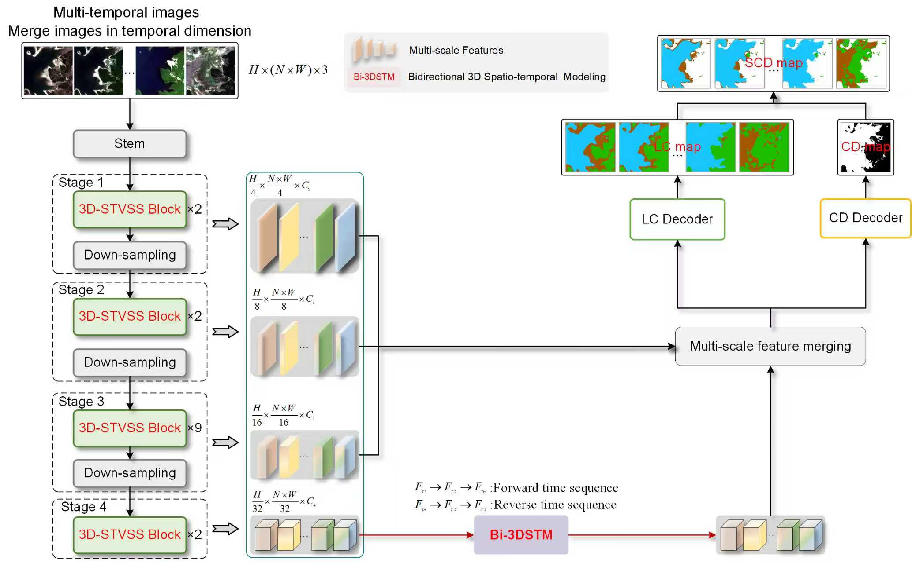
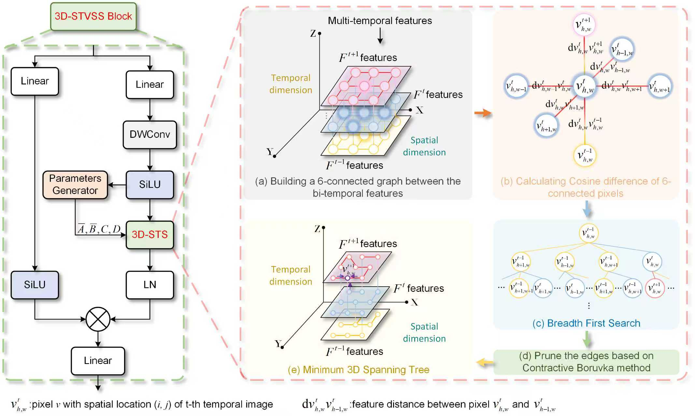

# GSTM-SCD
Pytorch codes of **GSTM-SCD: Graph-enhanced spatio-temporal state space model for semantic change detection in multi-temporal remote sensing images** [[paper](https://doi.org/10.1016/j.isprsjprs.2025.09.003)]

## Framework of the proposed GSTM-SCD. 

## Details of the GOST_Mamba


## Dataset Download

In the following, we summarize the processed semantic change detection data set used in this paper:

* [SECOND (Baidu)](https://pan.baidu.com/s/1RFhlO9_1KaFcIdTqblJIbA?pwd=dn84)
* [Landsat-SCD (Baidu)](https://pan.baidu.com/s/17tcdFBgMfx6d_BOsX6lzbw?pwd=hy5w)
* [WUSU (Baidu)](https://pan.baidu.com/s/1wDfVPU5bKpujBAZQTKpdYg?pwd=pxhq)
* [DynamicEarthNet (Baidu)](https://pan.baidu.com/s/1KekpsM2OXuXqeFy4pOv_XA?pwd=yfyg)

## 🛠️ Environment Setup (Refer to https://bgithub.xyz/EasonXiao-888/MambaTree/edit/main/README.md)

#### Vision Tasks
```txt
conda create -n GSTM-SCD python=3.10
conda activate GSTM-SCD

# Install pytorch 
pip install torch==2.1.1+cu118 torchvision==0.16.1+cu118 torchaudio==2.1.1 --extra-index-url https://download.pytorch.org/whl/cu118

# Install other packages
pip install -r requirements.txt 

# Install Vision_Tree_Scanning
cd GrootV/third-party/TreeScan
pip install -v -e .

# Note: You'd better use CUDA 11.8.
```

## How to Use
1. Dataset preparation.
   * Please split the data into training, validation and test sets and organize them as follows:
```
      YOUR_DATA_DIR
      ├── ...
      ├── train
      │   ├── im1
      │   ├── im2
      │   ├── ...
      │   ├── labelA
      │   ├── labelB
      │   ├── ...
      ├── val
      │   ├── im1
      │   ├── im2
      │   ├── ...
      │   ├── labelA
      │   ├── labelB
      │   ├── ...
      ├── test
      │   ├── im1
      │   ├── im2
      │   ├── ...
      │   ├── labelA
      │   ├── labelB
      │   ├── ...
```

2. Change the Options according to your dataset and models.
   * Take the SECOND data set as an example.
   * Find line 39 in [train_second.py](https://bgithub.xyz/liuxuanguang/GSTM-SCD/blob/main/train_second.py), change `--backbone` according to your model.
   * Find line 40 and line 35 in [inference_SECOND.py](https://github.com/IceStreams/EGMS-Net/blob/main/inference_SECOND.py), change `--data_root` to your local dataset directory

3. Training
   * If you train and inference the GSTM-SCD on the WUSU dataset (triple-temporal SCD), you need to change as follows:
   * Find line 137 in [GrootV/classification/models/tree_scan_utils/tree_scan_core.py](https://bgithub.xyz/liuxuanguang/GSTM-SCD/blob/main/GrootV/classification/models/tree_scan_utils/tree_scan_core.py), change 'def __init__(self, distance_func, mapping_func=None, Tem=None):' to 'def __init__(self, distance_func, mapping_func=None, Tem=3):'
   * Find line 348 in [GrootV/classification/models/tree_scan_utils/tree_scan_core.py](https://bgithub.xyz/liuxuanguang/GSTM-SCD/blob/main/GrootV/classification/models/tree_scan_utils/tree_scan_core.py), change 'index = self._build_matrix_index(guide_in, None)' to 'index = self._build_matrix_index(guide_in, 3):'
   * If you train and inference the GSTM-SCD on the DynamicEarthNet dataset, you need to change as follows:
   * Find line 137 in [GrootV/classification/models/tree_scan_utils/tree_scan_core.py](https://bgithub.xyz/liuxuanguang/GSTM-SCD/blob/main/GrootV/classification/models/tree_scan_utils/tree_scan_core.py), change 'def __init__(self, distance_func, mapping_func=None, Tem=None):' to 'def __init__(self, distance_func, mapping_func=None, Tem=6):'
   * Find line 348 in [GrootV/classification/models/tree_scan_utils/tree_scan_core.py](https://bgithub.xyz/liuxuanguang/GSTM-SCD/blob/main/GrootV/classification/models/tree_scan_utils/tree_scan_core.py), change 'index = self._build_matrix_index(guide_in, None)' to 'index = self._build_matrix_index(guide_in, 6):'

   * python train_***.py

5. Inference and evaluation
   
   python inference_second.py

## Cite GSTM-SCD

If you find this work useful or interesting, please consider citing the following BibTeX entry.

```
@article{LIU202573,
title = {GSTM-SCD: Graph-enhanced spatio-temporal state space model for semantic change detection in multi-temporal remote sensing images},
journal = {ISPRS Journal of Photogrammetry and Remote Sensing},
volume = {230},
pages = {73-91},
year = {2025},
issn = {0924-2716},
doi = {https://doi.org/10.1016/j.isprsjprs.2025.09.003},
url = {https://www.sciencedirect.com/science/article/pii/S0924271625003557},
author = {Xuanguang Liu and Chenguang Dai and Lei Ding and Zhenchao Zhang and Yujie Li and Xibing Zuo and Mengmeng Li and Hanyun Wang and Yuzhe Miao},
keywords = {Remote sensing, Semantic change detection, Time-series images, State space model, Graph optimization, Spatio-temporal modeling},
abstract = {Multi-temporal Semantic change detection (MT-SCD) provides crucial information for a wide variety of applications, including land use monitoring, urban planning, and sustainable development. However, previous deep learning-based SCD approaches exhibit limitations in time-series semantic change analysis, particularly in understanding Earth surface change dynamics. Specifically, literature methods typically employ Siamese networks to exploit the multi-temporal information. This hinders temporal interactions, failing to comprehensively model spatio-temporal dependencies, causing substantial classification and detection errors in complex scenes. Another key issue is the neglect of temporal transitivity consistency, resulting in predictions that contradict the multi-temporal change chain rules inherent to MT-SCD. Furthermore, literature approaches do not consider dynamic adaptation to the number of observation dates, failing to process time-series remote sensing images (RSIs) with arbitrary time steps. To address these challenges, we propose a graph-enhanced spatio-temporal Mamba (GSTM-SCD) for MT-SCD (including both bi-temporal SCD and time-series SCD). It employs vision state space models to capture the spatio-temporal dependencies in multi-temporal RSIs, and leverages graph modeling to enhance inter-temporal dependencies. First, we employ a single-branch Mamba encoder to efficiently exploit multi-temporal semantics and construct a spatio-temporal graph optimization mechanism to facilitate interactions between multi-temporal RSIs, while maintaining spatial continuity of feature representations. Second, we introduce a bidirectional three-dimensional change scanning strategy to learn underlying semantic change patterns. Finally, a novel loss function tailored for time-series SCD is proposed, which regularizes the multi-temporal topological relationships within data. The resulting approach, GSTM-SCD, demonstrates significant accuracy improvements compared to the state-of-the-art (SOTA) methods. Experiments conducted on four open benchmark datasets (SECOND, Landsat-SCD, WUSU and DynamicEarthNet) demonstrate that our method surpasses the SOTA by 0.53%, 1.66%, 9.32% and 0.78% in SeK, respectively. Moreover, it significantly reduces computational costs in comparison with recent SOTA methods. The associated codes is made available at: https://github.com/liuxuanguang/GSTM-SCD.}
}
```
